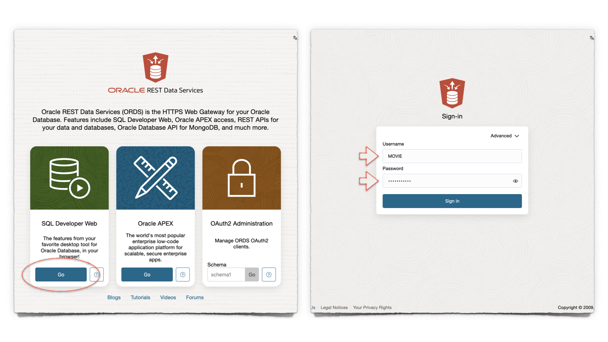
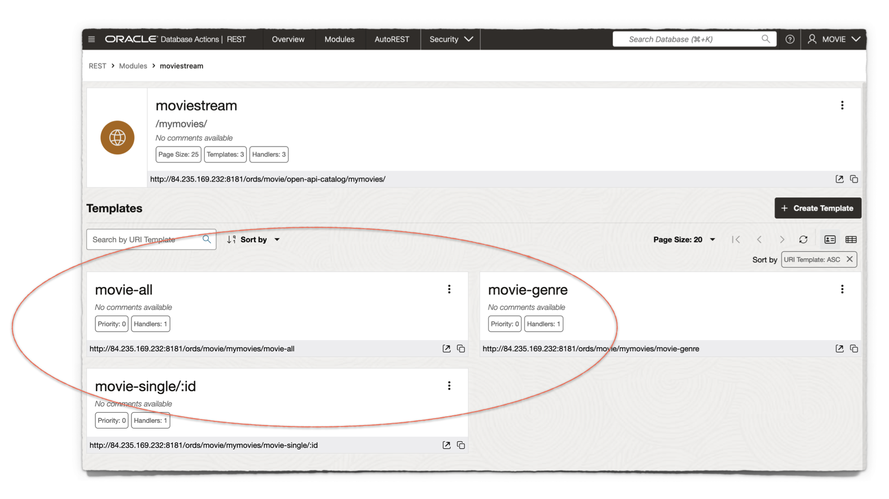

# Get Started

## Introduction

You have been provided with three URIs. One directs you to the Sign-in page for Database Actions. A schema has been prepared for you using the `MOVIE` user, who will be your development user during this workshop.

You have also been provided a URI for accessing the Jupyter lab. In this lab, you will notice a Python/Flask application, as well as the files and scripts used to run the sample ORDS application.

Finally, you have been provided a URI to OCI Cloud Storage. This is where the sample application project has been stored; in a `.zip` file.

Some experience in shell commands, Python, JavaScript, and HTML are helpful but not necessary. We've designed this workshop so even the beginner can complete it!

Estimated Time: 10 minutes

### Objectives

In this lab, you will:

* Obtain the application project contents from OCI Cloud Storage
* Sign in to Database Actions as the `MOVIE` user
* Create your ORDS APIs with the provided scripts
* Add your ORDS APIs to your project's files
* Start-up a simple ORDS + Python application

### Prerequisites

* An OCI Always Free, Free Tier, or paid tenancy
* A provisioned Oracle Autonomous Database and Integrated Developer Environment (IDE), or
* Access to a LiveLabs-provided sandbox environment
* Access to Database Actions
* Beginner-level experience in Python, HTML, and Integrated Developer Environments (IDEs)

This lab assumes you have:

* An Oracle account
* All previous labs successfully completed

## Task 1: Retrieve the project from OCI Cloud Storage

1. You have been provided three URLs. One for accessing Database Actions, one for accessing a Jupyter lab, and another for retrieving the sample application project file from OCI Cloud Storage. [Click here](https://c4u04.objectstorage.us-ashburn-1.oci.customer-oci.com/p/EcTjWk2IuZPZeNnD_fYMcgUhdNDIDA6rt9gaFj_WZMiL7VvxPBNMY60837hu5hga/n/c4u04/b/livelabsfiles/o/labfiles/ocw24flask.zip) to download a copy of the application's project files.  

   If you are unable to click, use the direct link here:  

     ```html
     <copy>
     https://c4u04.objectstorage.us-ashburn-1.oci.customer-oci.com/p/EcTjWk2IuZPZeNnD_fYMcgUhdNDIDA6rt9gaFj_WZMiL7VvxPBNMY60837hu5hga/n/c4u04/b/livelabsfiles/o/labfiles/ocw24flask.zip
     </copy>
     ```

2. Accept any dialogs that may appear, and download the `.zip` file to your `Downloads` folder.  

   

   >  If you choose to download this file to another folder, note its location. Later, you will need to transfer this `.zip` file to the Jupyter lab.

## Task 2: Database Actions, Part I

1. You <mark>have<mark> been provided two additional URLs. One for accessing Database Actions, and another one for accessing a Jupyter lab. First, navigate to Database Actions using the provided URL.

2. A new `MOVIE` user has been created for you. Its schema has already been REST-enabled, meaning you will be able to Sign in to Database Actions. To Sign in, click the <button type="button" style="pointer-events: none;">Go</button> button under the SQL Developer Web card.

   

   Once the Sign-in screen appears, enter the following credentials, and click the <button type="button" style="pointer-events: none;">Sign-in</button> button:

   &nbsp;&nbsp;&nbsp;&nbsp;&nbsp;&nbsp;&nbsp;&nbsp;Username: `MOVIE`  
   &nbsp;&nbsp;&nbsp;&nbsp;&nbsp;&nbsp;&nbsp;&nbsp;Password: `LiveLabs.Rocks_99`
  
3. The Database Actions Launchpad will appear. Navigate to the `Development` category, then click `SQL`. A blank SQL Worksheet will appear.

   

      > If this is your first time visiting the SQL Worksheet, a guided tour will appear. You may continue with the tour, or click the <button type="button" style="pointer-events: none;">X</button> (as seen in the image) to exit the tour.

4. You'll notice a `MOVIE` table has already been created for you. This table has also been pre-populated with movie data.

   To view a sample of the table's data<span class="fa fa-file-play" aria-hidden="true"></span> copy and paste the following SQL statement into the SQL Worksheet and click then `Run Statement` icon.

      ```sql
      <copy>
      SELECT * FROM MOVIE FETCH FIRST 10 ROWS ONLY;
      </copy>
      ```

   

   You will see results similar to the following image:

   

5. You may notice the varied data types in this table. To take a closer look at how this `MOVIE` table is structured, right-click on the `MOVIE` table, then select `Edit...`.

6. When the `Table Properties` slider appears, click `DDL`, then select the `Create` tab.

   Notice the following data types:

   

      ><svg xmlns="http://www.w3.org/2000/svg" width="16" height="16" fill="currentColor" class="bi bi-exclamation-circle-fill" viewBox="0 0 16 16"><path d="M16 8A8 8 0 1 1 0 8a8 8 0 0 1 16 0M8 4a.905.905 0 0 0-.9.995l.35 3.507a.552.552 0 0 0 1.1 0l.35-3.507A.905.905 0 0 0 8 4m.002 6a1 1 0 1 0 0 2 1 1 0 0 0 0-2"/></svg> ORDS APIs will be able to handle all of these various data types and send them to your application.

## Task 3: Jupyter lab, Part I

1. Using the second URL you were provided, log in to your Jupyter lab. The password is the same: `LiveLabs.Rocks_99`

   
  
2. Once logged in, you will see several directories. Navigate to the `ocw24flask` directory, then the `scripts` directory.

3. Double-click the `moviestream_resource_module_definitions.sql` file. This file contains the definitions for your Resource Module, Templates, and Handlers, which are your ORDS APIs.
  
      

4. Next, select all and copy the contents to your clipboard. Then, return to the SQL Worksheet.

## Task 4: Database Actions, Part II

1. Navigate to the SQL Worksheet. Then paste the contents of the `moviestream_resource_module_definitions.sql` file to the SQL Worksheet.
  
2. Click the <svg xmlns="http://www.w3.org/2000/svg" width="16" height="16" fill="currentColor" class="bi bi-play-circle-fill" viewBox="0 0 16 16"><path d="M16 8A8 8 0 1 1 0 8a8 8 0 0 1 16 0M6.79 5.093A.5.5 0 0 0 6 5.5v5a.5.5 0 0 0 .79.407l3.5-2.5a.5.5 0 0 0 0-.814z" focusable="false"/>
</svg>  `Run Script` icon. Upon completion, a `PL/SQL procedure successfully completed` message will appear in the `Script Output` tab.

   

   ><svg xmlns="http://www.w3.org/2000/svg" width="16" height="16" fill="currentColor" class="bi bi-exclamation-circle-fill" viewBox="0 0 16 16"><path d="M16 8A8 8 0 1 1 0 8a8 8 0 0 1 16 0M8 4a.905.905 0 0 0-.9.995l.35 3.507a.552.552 0 0 0 1.1 0l.35-3.507A.905.905 0 0 0 8 4m.002 6a1 1 0 1 0 0 2 1 1 0 0 0 0-2" focusable="false"/></svg> As you may know, the `MOVIE` schema has already been REST-enabled. For this reason, it is not necessary for you to execute the `ORDS.ENABLE_SCHEMA` PL/SQL procedure. Executing this procedure will cause no disruptions. The full script is provided for your convenience.

3. You've just created the ORDS APIs for the `Movie` user. To review the Resource Module, its Resource Templates and Resource Handlers, navigate to the REST Workshop.

   Click the <svg xmlns="http://www.w3.org/2000/svg" width="16" height="16" fill="currentColor" class="bi bi-list" viewBox="0 0 16 16">
  <path fill-rule="evenodd" d="M2.5 12a.5.5 0 0 1 .5-.5h10a.5.5 0 0 1 0 1H3a.5.5 0 0 1-.5-.5m0-4a.5.5 0 0 1 .5-.5h10a.5.5 0 0 1 0 1H3a.5.5 0 0 1-.5-.5m0-4a.5.5 0 0 1 .5-.5h10a.5.5 0 0 1 0 1H3a.5.5 0 0 1-.5-.5" focusable="false"/>
</svg> hamburger menu from the top of Database Actions, then click REST.

   

4. You'll notice a single Module in the Workshop's Object panel. Click it, then click the `moviestream` card.

   

5. You'll now see the newly created Resource Templates. Each Template contains a single `GET` Resource Handler. These are your ORDS APIs; you'll rely on them to feed data to your application.

   

6. Next, copy each of these URI's to your clipboard.

   ><svg xmlns="http://www.w3.org/2000/svg" width="16" height="16" fill="currentColor" class="bi bi-exclamation-circle-fill" viewBox="0 0 16 16"><path d="M16 8A8 8 0 1 1 0 8a8 8 0 0 1 16 0M8 4a.905.905 0 0 0-.9.995l.35 3.507a.552.552 0 0 0 1.1 0l.35-3.507A.905.905 0 0 0 8 4m.002 6a1 1 0 1 0 0 2 1 1 0 0 0 0-2" focusable="false"/></svg> In a few moments, you will return to the Jupyter lab to input these into the application code.

   

## Task 5: Jupyter Lab, Part II

1. Navigate back to the Jupyter lab. Once there, locate the `ocw24flask` directory. Double click the `ordsflask.py` file.

   

   You will notice two request variables, `r1` and `r2`. They will both have temporary, placeholder URIs.

2. Replace the `r1` temporary URI with the one you captured in the previous lab. The ORDS URI ending in `/movie-genre` will go here. Next, replace the `/r2` temporary URI with the `/movie-all` URI.

   Verify that your `r1` and `r2` variables are structured like those in the image. Then, save your changes.

   

3. Next, locate the `static` directory, then double-click the `functions.js` file. Here, you will see another ORDS URI placeholder. Replace it with your `/movie-single/:id` URI.

   Verify that your `const response = ...` is structured exactly as the image shows (your URI will differ). Then, save your changes.

   

## Task 6: Start the Flask application

1. From the Jupyter Launcher, open a new Terminal. If you are not in the `ords24flask` folder, then `cd` to it. Issue the `ls` command to verify the `ordsflask.py` file exists.

   Issue the following command:

      ```sh
      <copy>
      python ordsflask.py
      </copy>
      ```  

   The Flask development server will start up.

   

2. Your application will be available on port 5000. However, you will need to open the application in a new tab and modify the URL you were given for the Jupyter lab and Database Actions. This can be seen in the following image and your lab's terminal.

   Navigate to the new tab and combine the lab's URI with port 5000. Accept any warnings and your application will load.

   

3. With the application running, we'll next explore the ORDS APIs and how they feed data to your application.

## Learn More

* [ORDS RESTful services terminology](https://docs.oracle.com/en/database/oracle/oracle-rest-data-services/24.2/orddg/developing-REST-applications.html#GUID-50E24524-32BB-470D-8015-6C25C9B47A44)
* [Flask installation and configuration](https://flask.palletsprojects.com/en/3.0.x/installation/)
* [Visual Studio Code Flask tutorial](https://code.visualstudio.com/docs/python/tutorial-flask)

## Acknowledgements

* **Author** - Chris Hoina, Senior Product Manager, Database Tools
* **Contributors** -  Jeff Smith, Distinguished Product Manager, Database Tools
* **Last Updated By/Date** - Chris Hoina, Database Tools, July 2024
