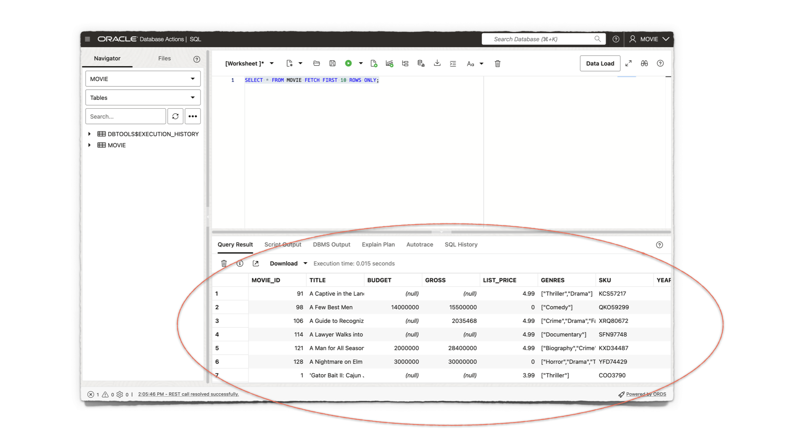
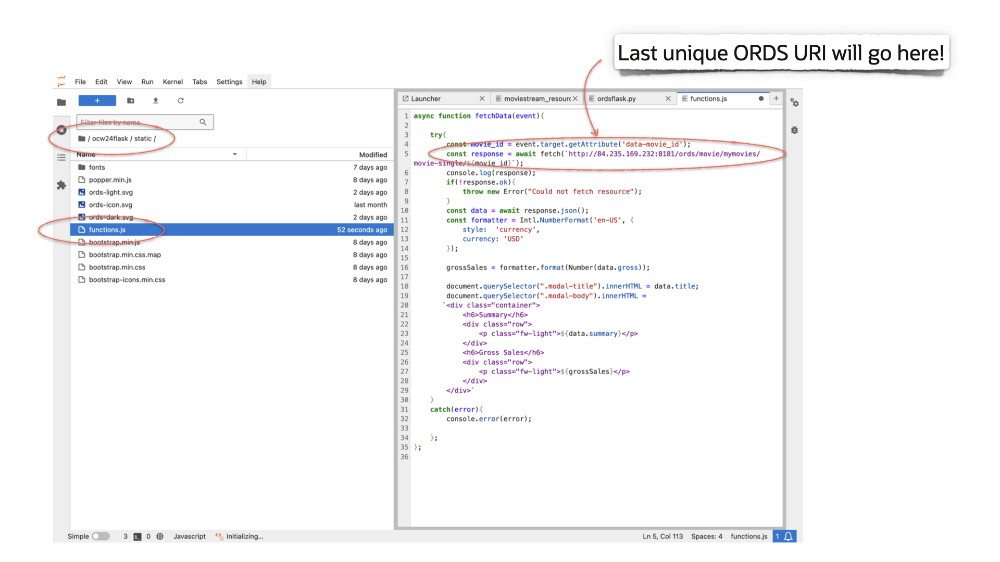
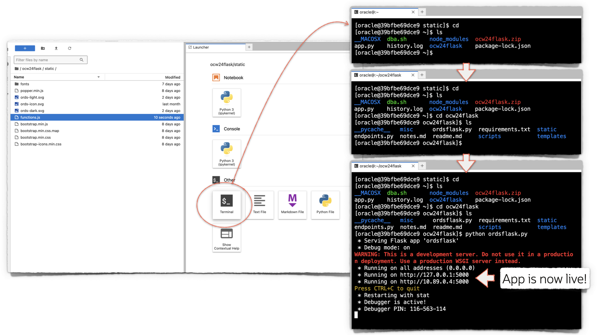

# Get Started

## Introduction

Estimated Time: 10 minutes

### About Oracle REST Data Services

??

### Objectives

In this lab, you will:

* Retrieve from Oracle Object Storage the sample application project folder
* Extract the project folder
* Set up the project
* Install all required Python dependencies

### Prerequisites

* An OCI Always Free, Free Tier or paid tenancy
* A provisioned Oracle Autonomous Database
* Access to Database Actions as the Admin user

This lab assumes you have:

* An Oracle account
* All previous labs successfully completed

## Task 1: Database Actions, Part I

1. You have been provided two URLs. One is for accessing Database Actions, the other for Jupyter notebook. Navigate to the URL for Database Actions.

2. A new `MOVIE` user has been created for you; its schema REST-enabled. Click <button type="button" style="pointer-events: none;">Go</button> under the SQL Developer Web card, to Sign-in.

   

   Once the Sign-in screen appears, enter the following credentials, and click the <button type="button" style="pointer-events: none;">Sign-in</button> button:

   &nbsp;&nbsp;&nbsp;&nbsp;&nbsp;&nbsp;&nbsp;&nbsp;Username: `MOVIE`  
   &nbsp;&nbsp;&nbsp;&nbsp;&nbsp;&nbsp;&nbsp;&nbsp;Password: `LiveLabs.Rocks_99`
  
3. The Database Actions Launchpad will appear. Navigate to the Development category, then click SQL. A blank SQL Worksheet will appear.

   

      > **NOTE:** If this is your first time visiting the SQL Worksheet, a guided tour will appear. You may continue with the tour, or click the <button type="button" style="pointer-events: none;">X</button> (as seen in the image) to exit.

4. You'll notice a `MOVIE` table has already been created for you.

   

   To view a sample of the table's data, execute the following SQL statement:

   ```sql
   <copy>
   SELECT * FROM MOVIE FETCH FIRST 10 ROWS ONLY;
   </copy>
   ```

   You should see results similar to the following image:

   

## Task 2: Jupyter lab, Part I

1. Use the second URL you were provided to log in to your Jupyter lab.

   
  
2. Once logged in, you will see several directories, and files. Navigate to the `ocw24flask` directory followed by the `scripts` directory.

   Once there, you will see several files. Double click the `moviestream_resource_module_definitions.sql` file.
  
      

3. You will select all and copy this file to your clipboard. Then, return to the SQL Worksheet.

## Task 3: Database Actions, Part II

1. Navigate to the SQL Worksheet. Then paste the contents of the SQL file to the SQL Worksheet.

   Pay special attention to the `ORDS.ENABLE_SCHEMA` procedure. Verify the two parameters match the following:

   * `p_schema => 'MOVIE'`
   * `p_url_mapping_pattern => 'movie'`

   Once you have verified that these parameters are correct, click the `Run Script` icon. The script will run and a `PL/SQL procedure successfully completed.` message will appear in the Output panel's Script Output tab.

      

2. To review the Resource Module, its Resource Templates and Resource Handlers, navigate to the REST Workshop.

   Click the <svg xmlns="http://www.w3.org/2000/svg" width="16" height="16" fill="currentColor" class="bi bi-list" viewBox="0 0 16 16">
  <path fill-rule="evenodd" d="M2.5 12a.5.5 0 0 1 .5-.5h10a.5.5 0 0 1 0 1H3a.5.5 0 0 1-.5-.5m0-4a.5.5 0 0 1 .5-.5h10a.5.5 0 0 1 0 1H3a.5.5 0 0 1-.5-.5m0-4a.5.5 0 0 1 .5-.5h10a.5.5 0 0 1 0 1H3a.5.5 0 0 1-.5-.5"/>
</svg> hamburger menu from the top of Database Actions, then click REST.

   

3. You'll notice a single Module in the Workshop Objects. Click it, then click the `moviestream` card.

   

4. You'll now see the newly created Resource Templates. Each of the templates contains a single `GET` Resource Handler. These are your ORDS APIs, you'll rely on them to feed data to your application.

   

5. You will need to copy each of these URI's to your clipboard. In a few moments, you will return to the Jupyter lab to input these into the application code.

   

## Task 4: Jupyter Lab, Part II

1. Navigate back to the Jupyter lab. Once there, locate the `ocw24flask` directory. Double click the `ordsflask.py` file.

   

   You will notice two request variables, `r1` and `r2`. They will both have temporary, placeholder URIs.

2. Replace the `r1` temporary URI with the one you captured in the previous lab. The ORDS URI ending in `/movie-genre` will go here. Next, replace the `/r2` temporary URI with the `/movie-all` URI.

   Verify that your `r1` and `r2` variables are structured like those seen in the image. Make sure to save your changes.

   

3. Next, locate the `static` directory, then double click the `functions.js` file. Here you will see another ORDS URI placeholder. Replace it with your `/movie-single/:id` URI.

   Verify your `const response = ...` is structured exactly how the image shows (your URI will differ). Then save your changes.

   

## Task 4: Start the Flask application

1. From the Jupyter Launcher, open a new Terminal. If you are not in the `ords24flask` folder, then `cd` to it. Issue the `ls` command to verify the `ordsflask.py` file exists.

   Issue the following command: `python ordsflask.py`. The Flask development server will start up.

   

2. Your application will be available on port 5000. However, you will need to open the application in a new tab, and use the same URL for the Jupyter lab and Database Actions instead of the URLs seen in the terminal.

   Navigate to the new tab and combine the lab's URI with port 5000. Accept any warnings and your application will load.

   

3. With the application running, we'll next explore the ORDS APIs and how they feed data to your application.

## Learn More

* [ORDS RESTful services terminology](https://docs.oracle.com/en/database/oracle/oracle-rest-data-services/24.2/orddg/developing-REST-applications.html#GUID-50E24524-32BB-470D-8015-6C25C9B47A44)
* [Flask installation and configuration](https://flask.palletsprojects.com/en/3.0.x/installation/)
* [Visual Studio Code Flask tutorial](https://code.visualstudio.com/docs/python/tutorial-flask)

## Acknowledgements

* **Author** - Chris Hoina, Senior Product Manager, Database Tools
* **Contributors** -  Jeff Smith, Distinguished Product Manager, Database Tools
* **Last Updated By/Date** - Chris Hoina, Database Tools, July 2024
