# Pagination with Oracle REST Data Services

## Introduction

In this lab you will explore how to page results when working with ORDS APIs. You'll explore how this sample application takes advantage of ORDS pagination as well.

Estimated Time: 20 minutes

### Objectives

In this lab, you will:

* Discover how pagination works in ORDS
* Learn you can automate pagination
* Learn how you can dynamically page results
* [relative lab url test](?lab=need-help)

### Prerequisites

This lab assumes you have:

* An Oracle account
* All previous labs successfully completed

  > **Note:** If you have a **Free Trial** account, when your Free Trial expires your account will be converted to an **Always Free** account. You will not be able to conduct Free Tier workshops unless the Always Free environment is available. **[Click here for the Free Tier FAQ page.](https://www.oracle.com/cloud/free/faq.html)**

## Task 1: Locate `Previous` and `Next` buttons

<!-- Images -->

1. Scroll to the bottom of any `movieresults.html` page, and locate the <button style="pointer-events: none;">Previous</button> and <button style="pointer-events: none;">Next</button> buttons.

    

2. These buttons are enabled or disabled based on the existence or absence of ORDS properties in a `GET` request's JSON response payload. To explore an example of payload, use your web browser to navigate to the following URI:

   ```sh
   <copy>
   http://84.235.169.232:8181/ords/movie/mymovies/movie-all?genre=Comedy&runtime=210
   </copy>
   ```

   > Your URI may appear different. Regardless, ensure you use valid query parameters.

3. You should see the results of the `GET` request on your page. They will look similar to the following:

    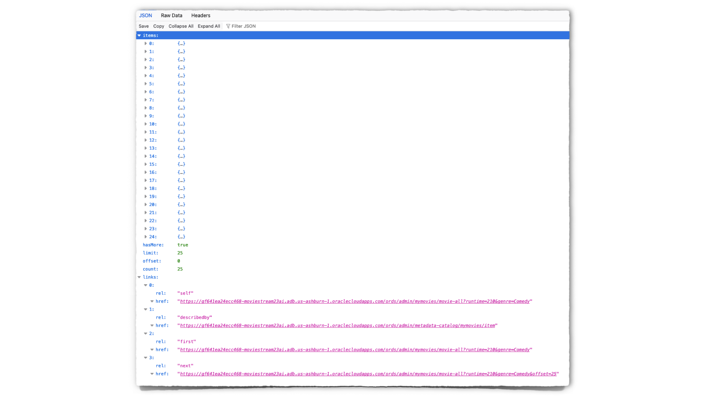

    > **NOTE:** The `items` the image's `items` properties have been collapsed to better show the entire contents of this JSON payload.

4. The typical ORDS payload consists of the following properties:

   * `items`

     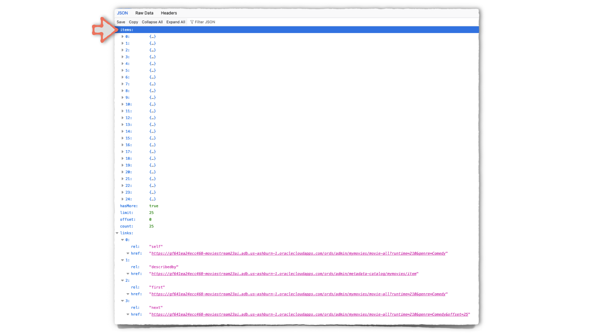

   * `hasMore`

     
  
   * `limit`

     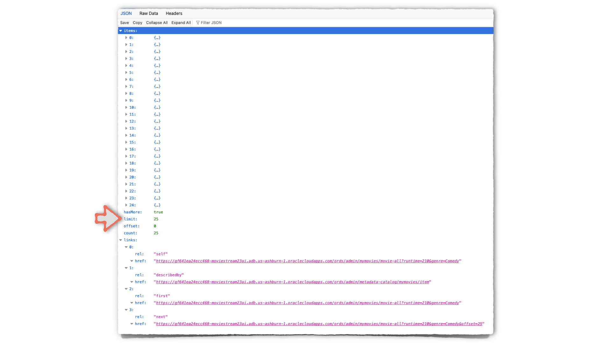

   * `offset`

     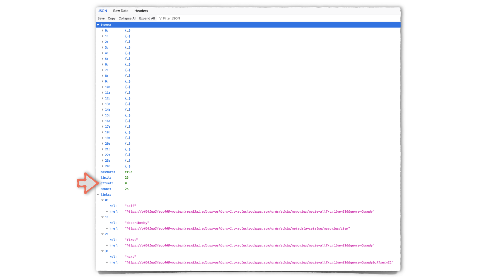

   * `count`

     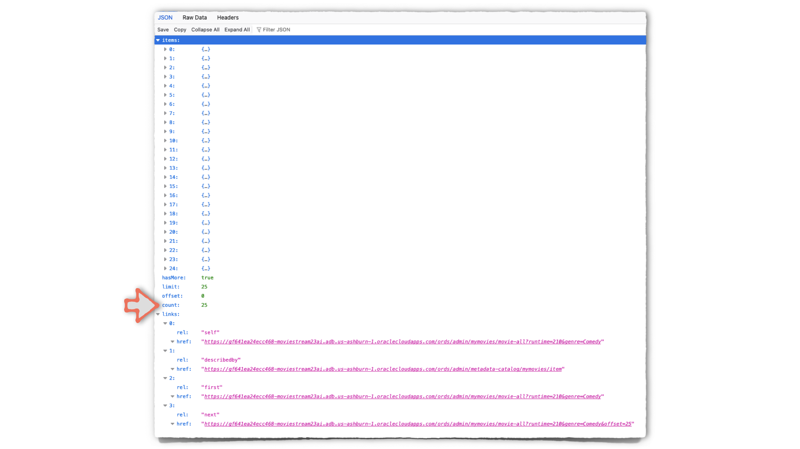

   * `links`

     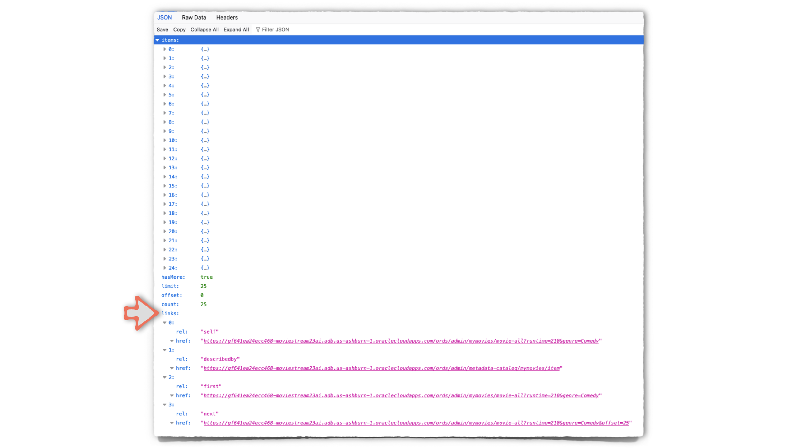

5. The `limit`, `offset`, and `count` properties are interrelated. For instance, if you were to select `25` as the page size, ORDS would only return results in increments of `25`. How does ORDS know to do this? It was set for you automatically, when you created your Resource Module.

   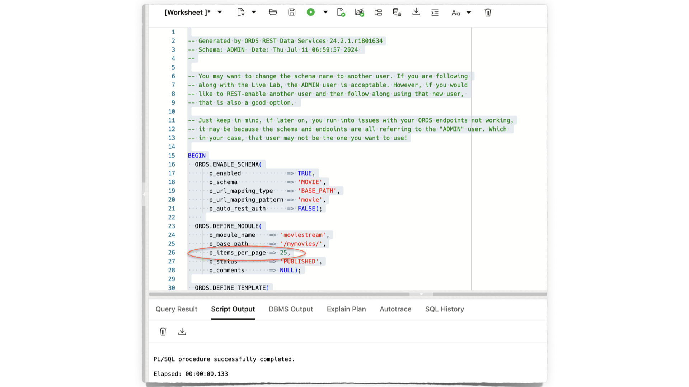

   Although, you can modify this parameter. Here is one option, modifying in the REST Workshop.

    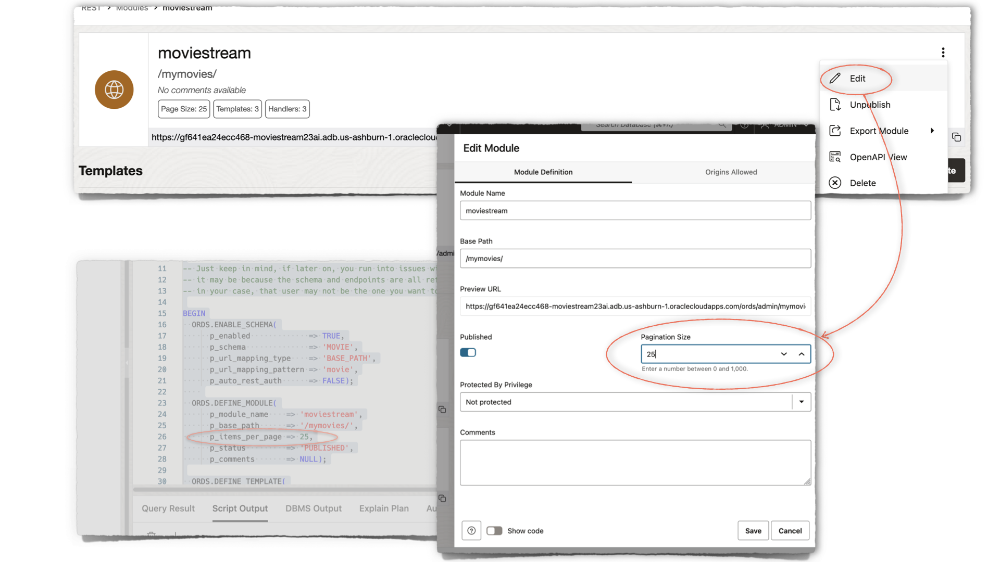

6. Returning to the JSON payload, you'll notice on the first page of results the `hasMore: true` condition.

   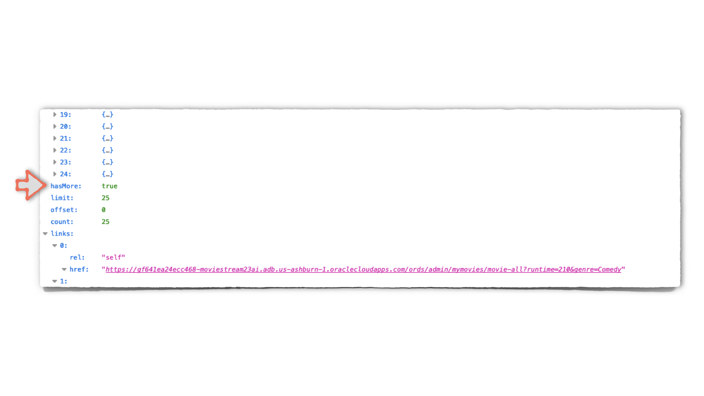

   This informs the user, client, or application that more data is available. When this condition is true, a `next` link will be made available. You'll notice this `next` link already includes the appropriate `offset`. These details make pagination simple with ORDS APIs.

    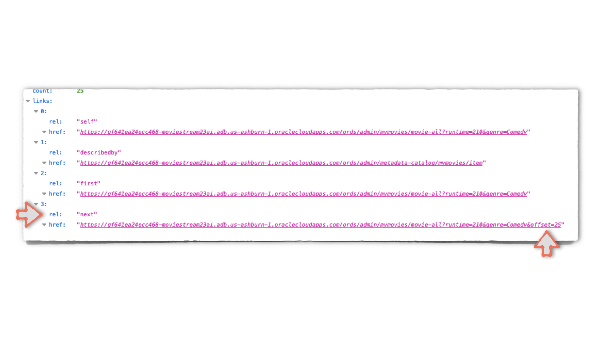

7. Click the `next` link. The next page of results will be displayed. After reviewing, scroll to the `links` property. Notice anything new or different?

    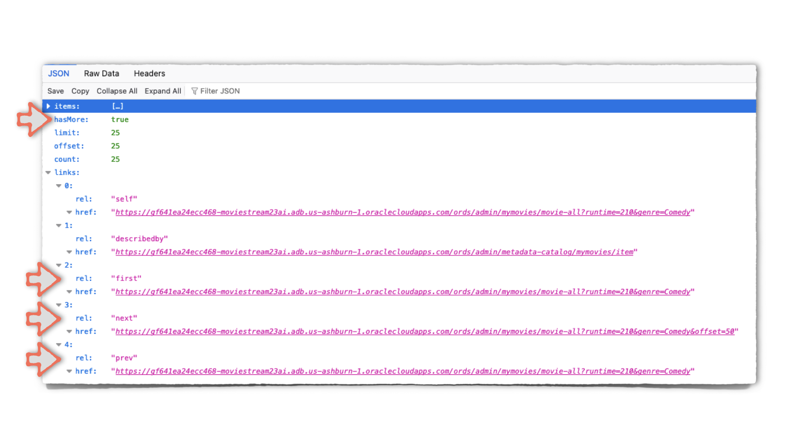

   You should see the `hasMore: true` condition, but you'll also notice a `previous` link, in addition to the `first` and `next` links. These links make connecting pagination to your UI simpler.

8. If you were to continue clicking the `next` link, eventually you would observe the last page available. It would look like this:

    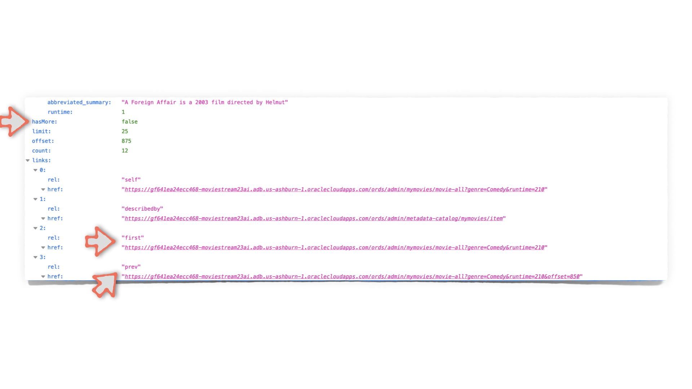

   You'd notice the `hasMore: false` property. This signifies to the user, client, or application, that no more results exist. You'd also notice the absence of a `next` link.

9. Next we'll take a look at how this application uses this information.

## Task 2: Reviewing the application

1. Navigate to the `hello.py` file. Locate the `@app.route('/next_page', methods=['GET', 'POST'])` line.

    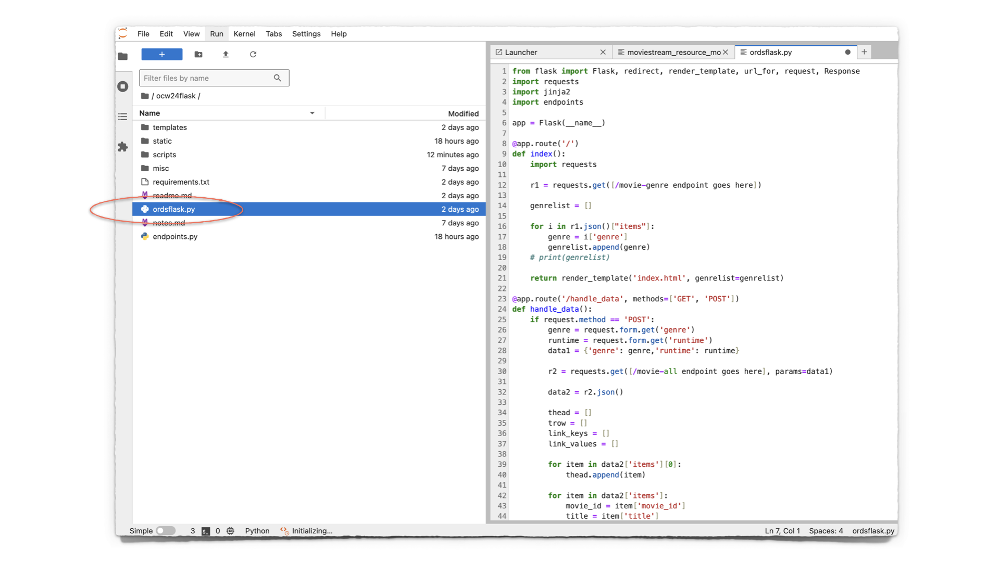

2. This code is nearly identical to that found in the `@app.route('/handle_data')`. However, instead of expecting an initial selection (where a user selects a genre and movie runtime), this route expects a `next` URI. There is an identical route for the `previous` links too.

3. After this `next_page` function assembles the necessary information, a new `movieresults.html` page is rendered and delivered to  the UI. All `next` and `previous` links are updated, allowing the user to navigate forward or backward.

    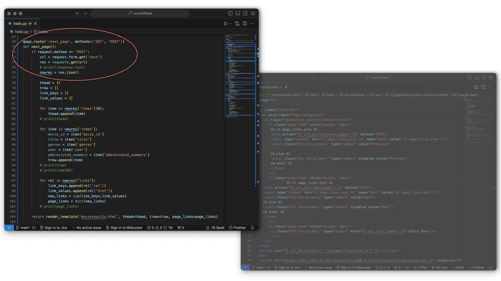

    

4. When viewing from the application, should a user reach the end or beginning of a results set, the html has been coded for two conditions.

   If a `previous` link is unavailable, then the <button style="pointer-events: none;">Previous</button> button is disabled by default.

      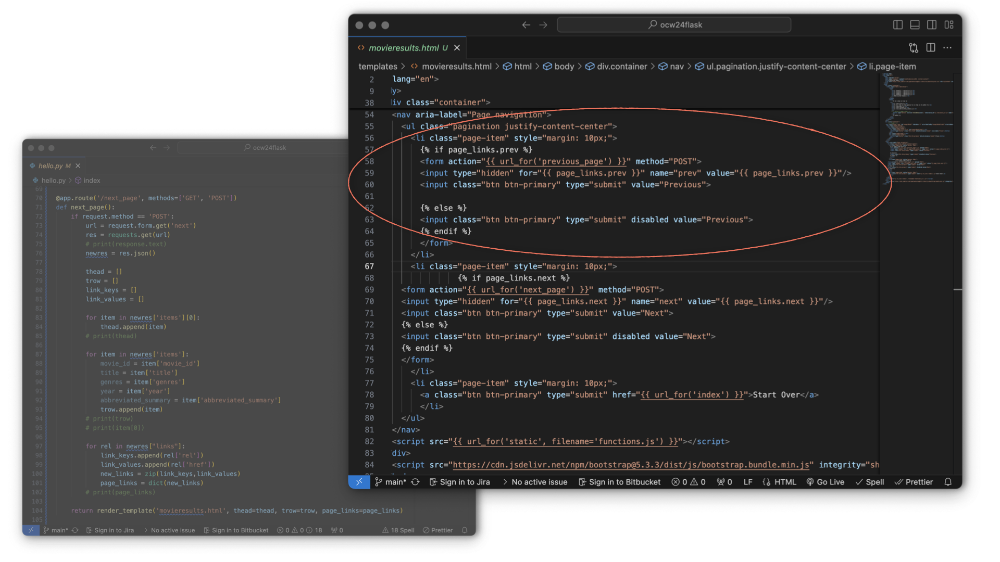

   And when a `next` link is not detected, then the <button style="pointer-events: none;">Next</button> button will be disabled too.

5. [Summary]

## Learn More

* [**Chapter 3.1.7.7** ORDS pagination](https://docs.oracle.com/en/database/oracle/oracle-rest-data-services/24.2/orddg/implicit-parameters.html#GUID-A7CE99EF-38E7-4FAB-A7C0-F8901B36B813)
* [**Blog** REST API: Paging results of a PL/SQL REFCURSOR](https://www.thatjeffsmith.com/archive/2023/11/rest-api-paging-results-of-a-pl-sql-refcursor/)
* [**Blog** How Paging Works in ORDS](https://www.thatjeffsmith.com/archive/2019/12/how-paging-works-in-ords/)
* [**Blog** ORDS + JS Fetch API](https://followthecoffee.com/ords-api-sql-from-json-view/)

## Acknowledgements

* **Author** - Chris Hoina, Senior Product Manager, Database Tools
* **Contributors** - Jeff Smith, Distinguished Product Manager, Database Tools
* **Last Updated By/Date** - Chris Hoina, Database Tools, July 2024
